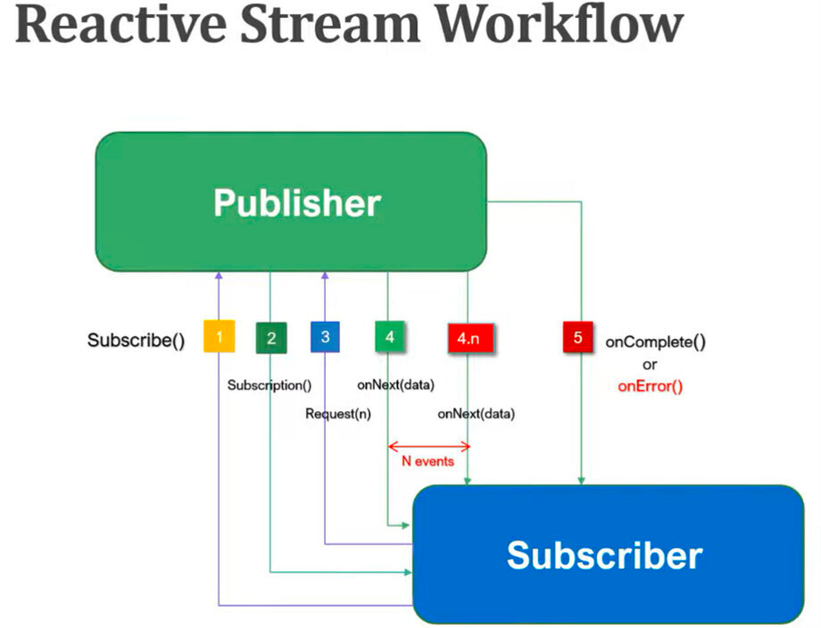

# Reactor-core-learning

- Docs
  reacotor: [https://projectreactor.io/docs/core/release/reference/](https://projectreactor.io/docs/core/release/reference/)
- Docs
  Flux: [https://projectreactor.io/docs/core/release/api/reactor/core/publisher/Flux.html](https://projectreactor.io/docs/core/release/api/reactor/core/publisher/Flux.html)
- Docs
  Mono: [https://projectreactor.io/docs/core/release/api/reactor/core/publisher/Mono.html](https://projectreactor.io/docs/core/release/api/reactor/core/publisher/Mono.html)

## Project Reactor

Reactive programming is a declarative programming paradigm concerned with data streams and the propagation of change.

Reactor is a fully non-blocking reactive programming foundation for the JVM, with efficient demand management (in the
form of managing "backpressure").

It offers composable asynchronous sequence APIs Flux (for [N] elements) and Mono (for [0|1] elements), extensively
implementing the Reactive Extensions specification.

## Difference to imperative approach

- imperative

```bash
    b = 1
    c = 2
    a = b + c
    b = 2
    print a; // 3
```

- reactive

```bash
    b = 1
    c = 2
    a = b + c
    b = 2
    print a; // 4
```

## Reactor API

Project reactor libraries provide two implementations of the `Publisher` interface:

- [Mono](https://projectreactor.io/docs/core/release/api/reactor/core/publisher/Mono.html)
- [Flux](https://projectreactor.io/docs/core/release/api/reactor/core/publisher/Flux.html)

`Mono`: Returns 0 or 1 element.
The Mono API allows producing only one value.

`Flux`: Returns 0…N elements.
The Flux can be endless, it can produce multiple values.

## Mono & Flux

Mono and Flux are both implementations of the Publisher interface. In simple terms, we can say that when we're doing
something like a computation or making a request to a database or an external service, and expecting a maximum of one
result, then we should use Mono.

When we're expecting multiple results from our computation, database, or external service call, then we should use Flux.

## Reactive Streams Specification in Java

- Publisher

```java
public interface Publisher<T> {
    void subscribe(Subscriber<? super T> var1);
}
```

- Subscriber

```java
public interface Subscriber<T> {
    void onSubscribe(Subcription<? super T> var1);

    void onNext(T var1);

    voud onError(Throwable var1);

    voiud onCompleted();
}
```

- Subscription

```java
public interface Subscription {
    void request(long var1);

    void cancel();
}
```

- Processor

```java
public interface Processor<T, R> extends Subscriber<T>, Publisher<R> {

}
```

## Reactive Stream Workflow



Let's understand the above Reactive stream workflow:

1. The `Subscriber` will call `subscribe()` method of the `Publisher` to subscribe or register with the Publisher.

2. The `Publisher` creates an instance of `Subscription` and sends it to Subscriber saying that your subscription is
   successful.

3. Next, the `Subscriber` will call the `request(n)` method of `Subscription` to request data from the Publisher.

4. Next, `Publisher` call `onNext(data)` method to send data to the `Subscriber`. `Publisher` call `onNext(data)` n
   times. It means if there are 10 items then the `Publisher` call `onNext(data)` method 10 times.

5. Once the `Publisher` sends all the data to `Subscriber`, the next `Publisher` call `onComplete()` method to
   notify `Subscriber` that all the data has been sent. If there are any errors while sending the data then
   the `Publisher` call `onError()` method to send error details to the `Subscriber`.

## Mono & Flux Examples

Use Mono and Flux, make sure that you add Project Reactor Core dependency:

```xml

<dependency>
    <groupId>io.projectreactor</groupId>
    <artifactId>reactor-core</artifactId>
    <version>3.5.1</version>
</dependency>
```

#### Example 1:

```java
public class FluxAndMonoServices {

    public Mono<String> fruitMono() {
        return Mono.just("Mango").log();
    }

    public static void main(String[] args) {

        FluxAndMonoServices fluxAndMonoServices
                = new FluxAndMonoServices();

        fluxAndMonoServices.fruitMono()
                .subscribe(s -> {
                    System.out.println("Mono -> s = " + s);
                });
    }
}
````

Output: Mono -> s = Mango

#### Example 2:

```java
public class FluxAndMonoServices {

    public Mono<String> fruitMono() {
        return Mono.just("Mango").log()
                .then(Mono.error(new RuntimeException("Error Occurred while publishing data")));
    }

    public static void main(String[] args) {

        FluxAndMonoServices fluxAndMonoServices
                = new FluxAndMonoServices();

        fluxAndMonoServices.fruitMono()
                .subscribe(s -> {
                    System.out.println("Mono -> s = " + s);
                });
    }
}
```

Output: ERROR reactor.core.publisher.Operators - Operator called default onErrorDropped ...

#### Example 3:

```java
public class FluxAndMonoServices {

    public Mono<String> fruitsMonoZipWith() {
        var fruits = Mono.just("Mango");
        var veggies = Mono.just("Tomato");

        return fruits.zipWith(veggies,
                (first, second) -> first + second).log();
    }

    public static void main(String[] args) {

        FluxAndMonoServices fluxAndMonoServices
                = new FluxAndMonoServices();

        fluxAndMonoServices.fruitsMonoZipWith()
                .subscribe(s -> {
                    System.out.println("Mono -> s = " + s);
                });
    }
}
```

Output: Mono -> s = MangoTomato


